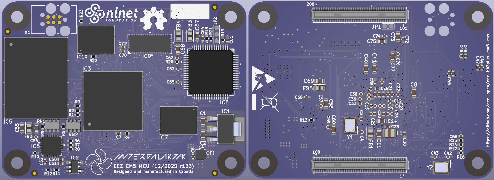

### This is a WORK IN PROGRESS!

---

### Ownership and License
The contributors are listed in CONTRIB.TXT. 

### Overview

The MCU module uses a high performance STM32 MCU and is pin compatible with Raspberry Pi CM5. The MCU cannot generate an HDMI compatible signal, so a TI TFP410 is used to convert 24-bit RGB to HDMI compatible signal. Since the BB3+ offers dual display: a built-in 5" TFT touchscreen and an external monitor, a 1:2 high speed mux (TS3DV642) is used for destination selection.

### Feature list

* Raspberry Pi CM5 form factor (55 x 45 mm)
* [STM32H7R7L8H6H](https://www.st.com/en/microcontrollers-microprocessors/stm32h7r7l8.html) 32-bit High-Performance Arm Cortex-M7 MCU, 600 MHz, NeoChrom GPU
* 32 MB PSRAM
* 32 MB Flash memory
* 4 GB eMMC (100-pin FBGA)
* Two USB ports (FS/HS)
* 10/100 Mbps Ethernet
* 24-bit color video output with 1:2 MUX (HDMI® compatible)
* 6-layer PCB (without buried/blind vias)

### Related topics and links

* Intergalaktik [BB3-CM4](https://intergalaktik.eu/projects/bb3-cm4)
* [EEZ BB3+](https://github.com/eez-open/eez-bb3plus)
* [DIB DCP405+](https://github.com/eez-open/dib-dcp405plus) power module
* [EEZ BB3](https://github.com/eez-open/modular-psu)
* [EEZ Studio](https://www.envox.eu/studio/studio-introduction)
* [Discord](https://discord.com/invite/q5KAeeenNG) server
* [X](https://x.com/envox) (ex Twitter)
* [YouTube](https://www.youtube.com/c/eezopen) channel
* [EEVblog forum](https://www.eevblog.com/forum/projects/eez-h25005-a-possible-successor-of-eez-h24005-programmable-power-supply/) discussion

---

This work is financed by [NLnet](https://nlnet.nl/project/BB3-CM5/) foundation

